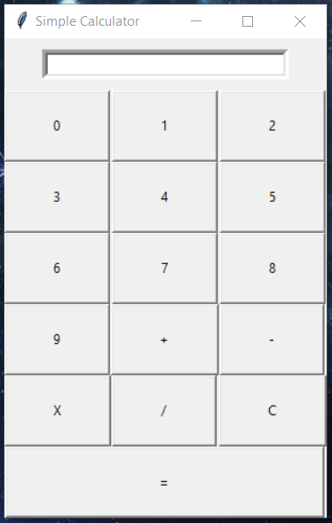

# Simple Calculator

A simple calculator application built using Tkinter, the standard GUI (Graphical User Interface) toolkit for Python.

## Table of Contents

1. [Introduction](#introduction)
2. [Features](#features)
3. [Usage](#usage)
4. [Dependencies](#dependencies)
5. [Installation](#installation)
6. [License](#license)

## Introduction

This project is a basic calculator application implemented in Python using the Tkinter library for the GUI. It provides a user-friendly interface for performing basic arithmetic operations such as addition, subtraction, multiplication, and division.

## Features

- Addition
- Subtraction
- Multiplication
- Division
- Clear function
- Error handling for division by zero

## Usage

1. Run the `simple_calculator.py` file.
2. Use the number buttons (0-9) to input numbers.
3. Use the operator buttons (+, -, *, /) to perform arithmetic operations.
4. Press the equals (=) button to get the result.
5. Press the clear (C) button to clear the input.

## Dependencies

- Python 3.x
- Tkinter (usually comes pre-installed with Python)

## Installation

There's no special installation process required for this project. Simply download or clone the repository and run the `calculator.py` file using Python.

## License

This project is licensed under the MIT License.
